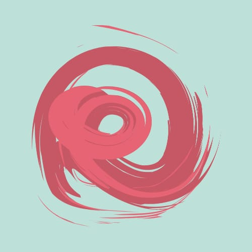

# 👋 Bem-vindo ao repositório das turmas

## 🔹 2025 - Primeiro Semestre - Turma Manhã

  
  

    <strong>Grupo 1 - AZD</strong>
    <a href="https://dieckdaniels.github.io/Ag-cia.AZD/">Empresa AZD</a>
    <a href="https://dieckdaniels.github.io/dieck-daniels/">Cliente AZD</a>
  

  
  

    <strong>Grupo 2 - TA LIGADO</strong>
    <a href="https://taligado-gamma.vercel.app/">Empresa TA LIGADO</a>
    <a href="https://docesdabencao.vercel.app/">Cliente TA LIGADO</a>
  

  
  

    <strong>Grupo 3 - SOL</strong>
    <a href="https://agenciasol.github.io/SOL/">Empresa SOL</a>
    <a href="https://agenciasol.github.io/siteTCC/">Cliente SOL</a>
  

  
  

    <strong>Grupo 4 - CATALISA</strong>
    <a href="https://catalisaagencia.github.io/agencia-catalisa/">Empresa CATALISA</a>
    <a href="https://lunix-terapia.github.io/cliente-lunix/">Cliente CATALISA</a>
  

  
  

    <strong>Grupo 5 - PILAR</strong>
    <a href="https://pilar-ca.vercel.app/">Empresa PILAR</a>
    <a href="https://insidelibras.vercel.app/">Cliente PILAR</a>
  

  
  

    <strong>Grupo 6 - URBANAMENTE</strong>
    <a href="https://urbanamente-consultoria.github.io/TCC-Urbanamente-IOS/">Empresa URBANAMENTE</a>
    <a href="https://urbanamente-consultoria.github.io/TCC-Sapataria_Afetiva-IOS/">Cliente URBANAMENTE</a>
  

