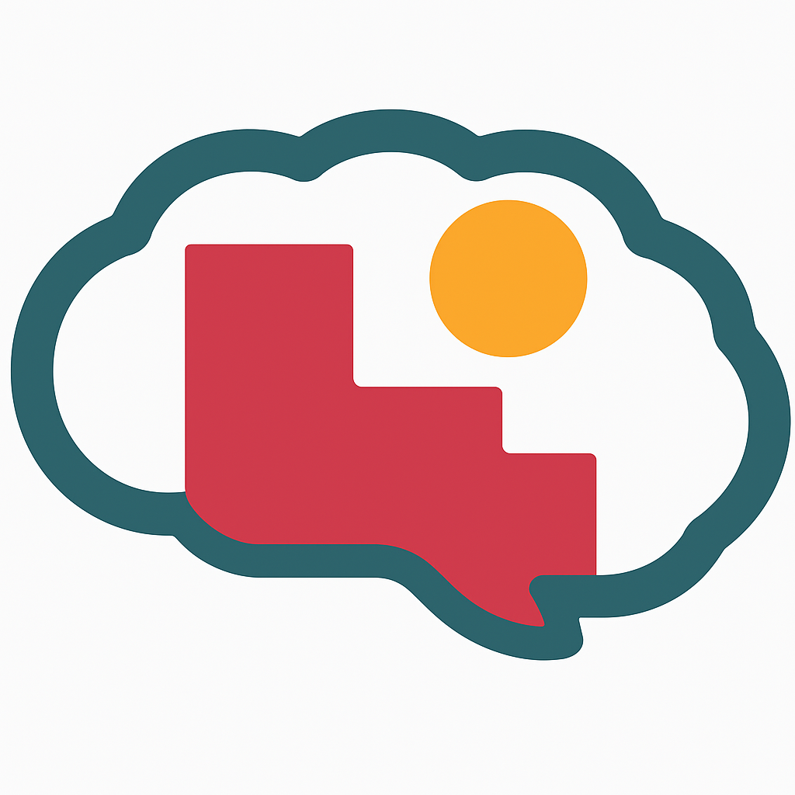

# Bem-vindo  👋 
## 🔹 2025 - PRIMEIRO SEMESTRE - TURMA TARDE

<!-- 🔹 Grupo 1 - AZD -->
<table width="100%">
  <tr>
    <td width="120">
      
    </td>
    <td style="min-width:400px;">
      <strong>Grupo 1 - AZD</strong> 
      <a href="https://dieckdaniels.github.io/Ag-cia.AZD/">Empresa AZD</a> 
      <a href="https://dieckdaniels.github.io/dieck-daniels/">Cliente AZD</a>
    </td>
  </tr>
</table>

<!-- 🔹 Grupo 2 - TA LIGADO -->
<table width="100%">
  <tr>
    <td width="120">
      
    </td>
    <td style="min-width:400px;">
      <strong>Grupo 2 - TA LIGADO</strong> 
      <a href="https://taligado-gamma.vercel.app/">Empresa TA LIGADO</a> 
      <a href="https://docesdabencao.vercel.app/">Cliente TA LIGADO</a>
    </td>
  </tr>
</table>

<!-- 🔹 Grupo 3 - SOL -->
<table width="100%">
  <tr>
    <td width="120">
      
    </td>
    <td style="min-width:400px;">
      <strong>Grupo 3 - SOL</strong> 
      <a href="https://agenciasol.github.io/SOL/">Empresa SOL</a> 
      <a href="https://agenciasol.github.io/siteTCC/">Cliente SOL</a>
    </td>
  </tr>
</table>

<!-- 🔹 Grupo 4 - CATALISA -->
<table width="100%">
  <tr>
    <td width="120">
      
    </td>
    <td style="min-width:400px;">
      <strong>Grupo 4 - CATALISA</strong> 
      <a href="https://catalisaagencia.github.io/agencia-catalisa/">Empresa CATALISA</a> 
      <a href="https://lunix-terapia.github.io/cliente-lunix/">Cliente CATALISA</a>
    </td>
  </tr>
</table>

<!-- 🔹 Grupo 5 - PILAR -->
<table width="100%">
  <tr>
    <td width="120">
      
    </td>
    <td style="min-width:400px;">
      <strong>Grupo 5 - PILAR</strong> 
      <a href="https://pilar-ca.vercel.app/">Empresa PILAR</a> 
      <a href="https://insidelibras.vercel.app/">Cliente PILAR</a>
    </td>
  </tr>
</table>

<!-- 🔹 Grupo 6 - URBANAMENTE -->
<table width="100%">
  <tr>
    <td width="120">
      
    </td>
    <td style="min-width:400px;">
      <strong>Grupo 6 - URBANAMENTE</strong> 
      <a href="https://urbanamente-consultoria.github.io/TCC-Urbanamente-IOS/">Empresa URBANAMENTE</a> 
      <a href="https://urbanamente-consultoria.github.io/TCC-Sapataria_Afetiva-IOS/">Cliente URBANAMENTE</a>
    </td>
  </tr>
</table>

</body>
